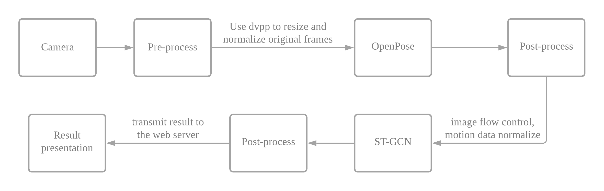

# Gesture Detection

## 1 项目简介

本项目将OpenPose、ST-GCN两种网络模型相结合，实现一个实时动作检测系统，并结合Presenter Server在Ascend Atlas 200 Develop Kit 上进行移植与部署，在Web端展示运行效果。

## 2 总体设计

系统运行的流程图如下：

具体步骤为：

1. 初始化：申请运行资源，加载模型文件，开启 Presenter Server
2. 特征点提取：OpenPose模型实时处理摄像头传输的图像，提取图像中的人体特征点
3. 动作推理：STGCN模型根据人体特征点序列推理动作类型
4. 结果输出：将推理结果放于当前视频流中，传输回Host端，由Presenter Server将其展示到Web端

### 网络结构

### 原始模型
#### OpenPose

OpenPose [1] 是基于卷积神经网络和监督学习的开源库,可以实现人的面部表情、躯干和四肢甚至手指的跟踪，不仅适用于单人也适用于多人，同时具有较好的鲁棒性。我们应用已训练的OpenPose模型，通过简单的后处理获得人体特征点，为了提升运行速度，只支持一人的特征识别。

#### STGCN

ST-GCN [2] 单元交替使用 ATT(图注意力模型)、GCN(图卷积网络)和 TCN(时间卷积网络)对图片的关节的特征数(空间维度)和关键帧数(时间维度)进行变换并提取特征，最后使用平均池化和全连接层对特征进行分类，输出行为分析结果。我们使用STGCN网络，结合自己训练的数据集 (链接: https://pan.baidu.com/s/1xuduKKvzVJa7t2pOMfVpPQ  密码: or8l) 进行训练，转化成Atlas开发板支持的offline model使用。

### 性能

可以实现15fps的实时动作识别，支持四种动作：up、down、left、right。

### 参考文献

[1]  Cao Z, Hidalgo G, Simon T, et al. OpenPose: realtime multi-person 2D pose estimation using Part Affinity Fields[J]. arXiv preprint arXiv:1812.08008, 2018. 

[2]  Yan S, Xiong Y, Lin D. Spatial temporal graph convolutional networks for skeleton-based action recognition[C]//Thirty-second AAAI conference on artificial intelligence. 2018.