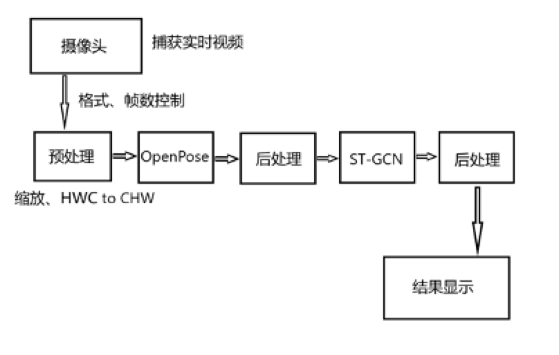

# Gesture Detection

<video src="./figures/present.mp4"></video>

## 1 项目简介

深度学习利用多层神经网络结构,从大量数据中学习现实世界中各类事物，越来越被广泛应用于计算机视觉领域，且可以达到不错的效果。用计算机视觉深度算法进行动作检测是目前视频理解方向的研究热点，因为该任务贴近生活，且在监控安防中有潜在的巨大价值，有造福社会、便利生活的巨大潜力。

为了探究基于深度学习的计算机视觉算法在Atlas 200 Developer Kit（版本20.0.0）上运行的可行性，本项目将OpenPose、ST-GCN两种网络模型相结合，实现一个实时动作检测系统，并结合Presenter Server在Atlas 200 DK上进行移植与部署，在Web端展示运行效果。

## 2 总体设计

1. 初始化：申请运行资源，加载模型文件，开启 Presenter Server

2. 视频流处理：OpenPose模型实时处理摄像头传输的图像，提取图像中的人体特征点

3. 动作推理：STGCN模型根据人体特征点序列推理动作类型

4. 结果输出：将推理结果放于当前视频流中，传输回Host端，由Server将其展示到Web端

### 总体设计

### 网络结构

### 原始模型
#### OpenPose
#### STGCN

### 预处理
### 后处理
### 性能

