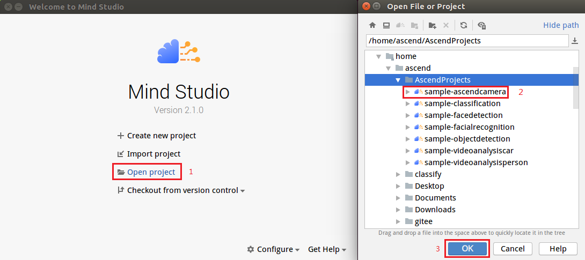

中文|[English](Readme_EN.md)

**该案例仅仅用于学习，打通流程，不对效果负责，不支持商用。**
# Ascend Camera<a name="ZH-CN_TOPIC_0232337157"></a>

Ascend Camera主要功能是通过Atlas 200 DK开发者板上的摄像头采集数据，经过DVPP转换为jpg，最终保存为文件或者远程输出。

当前分支中的应用适配**1.32.0.0及以上**版本的[DDK&RunTime](https://ascend.huawei.com/resources)。

## 前提条件<a name="zh-cn_topic_0228461908_section137245294533"></a>

部署此Sample前，需要准备好以下环境：

-   已完成Mind Studio的安装。
-   已完成Atlas 200 DK开发者板与Mind Studio的连接，交叉编译器的安装，SD卡的制作及基本信息的配置等。

## 部署<a name="zh-cn_topic_0228461908_section412811285117"></a>

可以选择如下快速部署或者常规方法部署，二选一即可：

1.  快速部署，请参考：  [https://gitee.com/Atlas200DK/faster-deploy](https://gitee.com/Atlas200DK/faster-deploy)  。

    > **说明：**   
    >-   该快速部署脚本可以快速部署多个案例，请选择**ascendcamera**案例部署即可。  
    >-   该快速部署脚本自动完成了代码下载、模型转换、环境变量配置等流程，如果需要了解详细的部署过程请选择常规部署方式。转：**[2. 常规部署](#zh-cn_topic_0228461908_li3208251440)**  

2.  <a name="zh-cn_topic_0228461908_li3208251440"></a>常规部署，请参考：  [https://gitee.com/Atlas200DK/sample-README/tree/master/sample-ascendcamera](https://gitee.com/Atlas200DK/sample-README/tree/master/sample-ascendcamera)  。

    > **说明：**   
    >-   该部署方式，需要手动完成代码下载、模型转换、环境变量配置等过程。完成后，会对其中的过程更加了解。  


## 编译<a name="zh-cn_topic_0228461908_section11947911019"></a>

1.  打开对应的工程。

    以Mind Studio安装用户进入安装包解压后的“MindStudio-ubuntu/bin”目录，如：$HOME/MindStudio-ubuntu/bin，执行如下命令启动Mind Studio。

    **.\/MindStudio.sh**

    启动成功后，打开**sample\-ascendcamera**  工程，如图所示。

    **图 1**  打开sample-camera工程<a name="zh-cn_topic_0228461908_zh-cn_topic_0203223312_fig1696912234714"></a>  
    

    

2.  在**src/param\_configure.conf**文件中配置相关工程信息。

    **图 2**  配置文件路径<a name="zh-cn_topic_0228461908_zh-cn_topic_0203223312_fig10430135171116"></a>  
    

    

    该配置文件默认配置内容如下：

    ```
    remote_host=192.168.1.2
    ```

    -   remote\_host：配置为Atlas 200 DK开发者板的IP地址。

    > **说明：**   
    >-   注意参数填写时不需要使用“”符号。  
    >-   当前已经按照配置示例配置默认值，请按照配置情况自行修改。  

3.  执行deploy脚本， 进行配置参数调整及第三方库下载编译 打开Mind Studio工具的Terminal，此时默认在代码主目录下，执行如下命令在后台指执行deploy脚本，进行环境部署。如[图 执行deploy脚本](#zh-cn_topic_0228461908_zh-cn_topic_0203223312_fig9298102581519)所示。

    **图 3**  执行deploy脚本<a name="zh-cn_topic_0228461908_zh-cn_topic_0203223312_fig9298102581519"></a>  
    

    > **说明：**   
    >-   首次deploy时，没有部署第三方库时会自动下载并编译，耗时可能比较久，请耐心等待。后续再重新编译时，不会重复下载编译，部署如上图所示。  
    >-   deploy时，需要选择与开发板通信的主机侧ip，一般为虚拟网卡配置的ip。如果此ip和开发板ip属于同网段，则会自动选择并部署。如果非同网段，则需要手动输入与开发板通信的主机侧ip才能完成deploy。  

4.  开始编译，打开Mind Studio工具，在工具栏中点击**Build \> Build \> Build-Configuration**。如[图4](#zh-cn_topic_0228461908_zh-cn_topic_0203223312_fig5350165415161)所示，会在目录下生成build和run文件夹。

    **图 4**  编译操作及生成文件<a name="zh-cn_topic_0228461908_zh-cn_topic_0203223312_fig5350165415161"></a>  
    

    

    > **须知：**   
    >首次编译工程时，**Build \> Build**为灰色不可点击状态。需要点击**Build \> Edit Build Configuration**，配置编译参数后再进行编译。  

5.  启动Presenter Server。

    打开Mind Studio工具的Terminal，在应用代码存放路径下，执行如下命令在后台启动Ascend Camera应用的Presenter Server主程序。如[图5](#zh-cn_topic_0228461908_zh-cn_topic_0203223312_fig815812478221)所示。

    **bash run\_present\_server.sh**

    **图 5**  启动PresenterServer<a name="zh-cn_topic_0228461908_zh-cn_topic_0203223312_fig815812478221"></a>  
    

    

    当提示“Please choose one to show the presenter in browser\(default: 127.0.0.1\):“时，请输入在浏览器中访问Presenter Server服务所使用的IP地址（一般为访问Mind Studio的IP地址。）

    如[图6](#zh-cn_topic_0228461908_zh-cn_topic_0203223312_fig20890201582816)所示，请在“Current environment valid ip list“中选择通过浏览器访问Presenter Server服务使用的IP地址。

    **图 6**  工程部署示意图<a name="zh-cn_topic_0228461908_zh-cn_topic_0203223312_fig20890201582816"></a>  
    

    

    如[图7](#zh-cn_topic_0228461908_zh-cn_topic_0203223312_fig143112216312)所示，表示presenter\_server的服务启动成功。

    **图 7**  Presenter Server进程启动<a name="zh-cn_topic_0228461908_zh-cn_topic_0203223312_fig143112216312"></a>  
    

    

    使用上图提示的URL登录Presenter Server，IP地址为[图6](#zh-cn_topic_0228461908_zh-cn_topic_0203223312_fig20890201582816)中输入的IP地址，端口号默为7003，如下图所示，表示Presenter Server启动成功。

    **图 8**  主页显示<a name="zh-cn_topic_0228461908_zh-cn_topic_0203223312_fig3338812171913"></a>  
    

    Presenter Server、Mind Studio与Atlas 200 DK之间通信使用的IP地址示例如下图所示：

    **图 9**  IP地址示例<a name="zh-cn_topic_0228461908_zh-cn_topic_0203223312_fig633991291914"></a>  
    

    -   Atlas 200 DK开发者板使用的IP地址为192.168.1.2（USB方式连接）。
    -   Presenter Server与Atlas 200 DK通信的IP地址为UI Host服务器中与Atlas 200 DK在同一网段的IP地址，例如：192.168.1.223。
    -   通过浏览器访问Presenter Server的IP地址本示例为：10.10.0.1，由于Presenter Server与Mind Studio部署在同一服务器，此IP地址也为通过浏览器访问Mind Studio的IP。


## 运行<a name="zh-cn_topic_0228461908_section123001119164920"></a>

运行Ascend Camera应用程序。

在Mind Studio工具的工具栏中找到Run按钮，点击  **Run \> Run 'sample-ascendcamera'**，在开发板运行程序，如[图10](#zh-cn_topic_0228461908_zh-cn_topic_0203223312_fig19482184244914)所示。

**图 10**  程序执行示意图<a name="zh-cn_topic_0228461908_zh-cn_topic_0203223312_fig19482184244914"></a>  


> **说明：**   
>报错信息忽略，因为IDE无法为可执行程序传参，上述步骤是将可执行程序与依赖的库文件部署到开发板，需要ssh登录到开发板至相应的目录文件下手动执行，具体请参考以下步骤。  

## 媒体信息离线保存<a name="zh-cn_topic_0228461908_section16681395119"></a>

1.  在Mind Studio所在Ubuntu服务器中，以HwHiAiUser用户SSH登录到开发者板。

    **ssh HwHiAiUser@192.168.1.2**

    对于Atlas 200 DK，host\_ip默认为192.168.1.2（USB连接）或者192.168.0.2（NIC连接）。

    对于AI加速云服务器，host\_ip即为当前Mind Studio所在服务器的IP地址。

2.  进入Ascend Camera的可执行文件所在路径。例如执行如下命令。

    **cd \~/HIAI\_PROJECTS/workspace\_mind\_studio/sample-ascendcamera\_5b4f8b24/out**

3.  例如执行**workspace\_mind\_studio\_sample-ascendcamera**命令进行媒体信息离线保存。

    从摄像头获取图片并保存为jpg文件，如果已经存在同名文件则覆盖。

    **./workspace\_mind\_studio\_sample-ascendcamera -i -c 1 -o  /localDirectory/filename.jpg --overwrite**

    -   -i：代表获取jpg格式的图片。
    -   -c：表示摄像头所在的channel，此参数有“0”和“1”两个选项，“0“对应“Camera1“，“1“对应“Camera2“，如果不填写，默认为“0”。查询摄像头所属Channel的方法请参考[Atlas 200 DK使用指南](https://ascend.huawei.com/doc)中的“如何查看摄像头所属Channel”。
    -   -o：表示文件存储位置，此处localDirectory为本地已存在的文件夹名称，filename.jpg为保存的图片名称，可用户自定义。

        > **说明：**   
        >此路径HwHiAiUser需要有可读写权限。  

    -   --overwrite：覆盖已存在的同名文件。

    其他详细参数请执行   **./workspace\_mind\_studio\_sample-ascendcamera**  命令或者  **./workspace\_mind\_studio\_sample\_ascendcamera --help**  命令参见帮助信息。


## 通过Presenter Server播放实时视频<a name="zh-cn_topic_0228461908_section20204154716116"></a>

1.  在Mind Studio所在Ubuntu服务器中，以HwHiAiUser用户SSH登录到开发者板。

    **ssh HwHiAiUser@192.168.1.2**

2.  进入Ascend Camera的可执行文件所在路径。例如执行如下命令。

    **cd \~/HIAI\_PROJECTS/workspace\_mind\_studio/sample-ascendcamera\_5b4f8b24/out**

3.  例如执行下命令将通过摄像头捕获的视频传输到Presenter Server。

    **./workspace\_mind\_studio\_sample-ascendcamera -v -c 1  -t 60 --fps 20 -w 704 -h 576 -s  _192.168.1.223:7002/presenter\_view\_app\_name_**

    -   -v：代表获取摄像头的视频，用来在Presenter Server端展示。
    -   -c：表示摄像头所在的channel，此参数有“0”和“1”两个选项，“0“对应“Camera1“，“1“对应“Camera2“，如果不填写，默认为“0”。查询摄像头所属Channel的方法请参考[Atlas 200 DK用户手册](https://ascend.huawei.com/doc/Atlas200DK/)中的“如何查看摄像头所属Channel”。
    -   -t：表示获取60s的视频文件，如果不指定此参数，则获取视频文件直至程序退出。
    -   --fps：表示存储视频的帧率，取值范围为1\~20，如果不设置此参数，则默认存储的视频帧率为10fps。
    -   -w：表示存储视频的宽。
    -   -h：表示存储视频的高。
    -   -s后面的值_ 192.168.1.223_  为Presenter中**7002**端口对应的IP地址（请参见启动Presenter Server回显显示的IP地址，即为与Atlas 200 DK开发者板通信的IP地址），**7002**为Ascendcamera应用对应的Presenter Server服务器的默认端口号。
    -   _presenter\_view\_app\_name_：为在Presenter Server端展示的“View Name“，用户自定义，需要保持唯一，只能为大小写字母、数字、“\_”的组合，位数3\~20。

    其他详细参数请执行  **./workspace\_mind\_studio\_sample-ascendcamera**  命令或者  **./workspace\_mind\_studio\_sample-ascendcamera  --help**  命令参见帮助信息。

    > **说明：**   
    >-   Ascend Camera的Presenter Server最多支持10路Channel同时显示，每个presenter\_view\_app\_name 对应一路Channel。  
    >-   由于硬件的限制，每一路支持的最大帧率是20fps，受限于网络带宽的影响，帧率会自动适配为较低的帧率进行展示。  


## 后续处理<a name="zh-cn_topic_0228461908_section856641210261"></a>

Presenter Server服务启动后会一直处于运行状态，若想停止Ascend Camera应用对应的Presenter Server服务，可执行如下操作。

以Mind Studio安装用户在Mind Studio所在服务器中的的命令行中执行如下命令查看Ascend Camera应用对应的Presenter Server服务的进程。

**ps -ef | grep presenter | grep display**

```
ascend@ascend-HP-ProDesk-600-G4-PCI-MT:~/sample-ascendcamera$ ps -ef | grep presenter | grep display
ascend 5758 20313 0 14:28 pts/24?? 00:00:00 python3 presenterserver/presenter_server.py --app display
```

如上所示  _5758_  即为Ascend Camera应用对应的Presenter Server服务的进程ID。

若想停止此服务，执行如下命令：

**kill -9** _5758_

