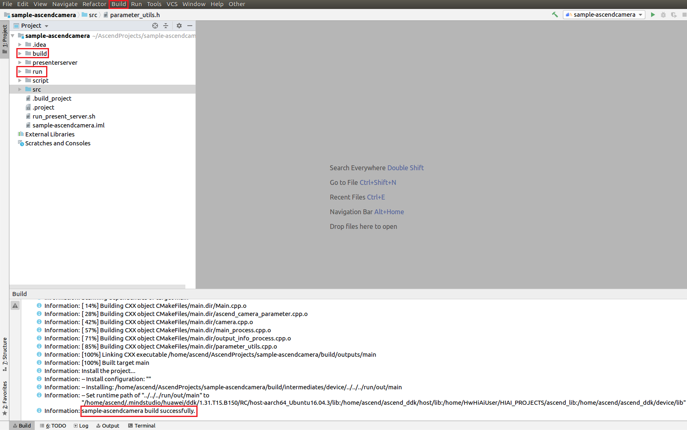
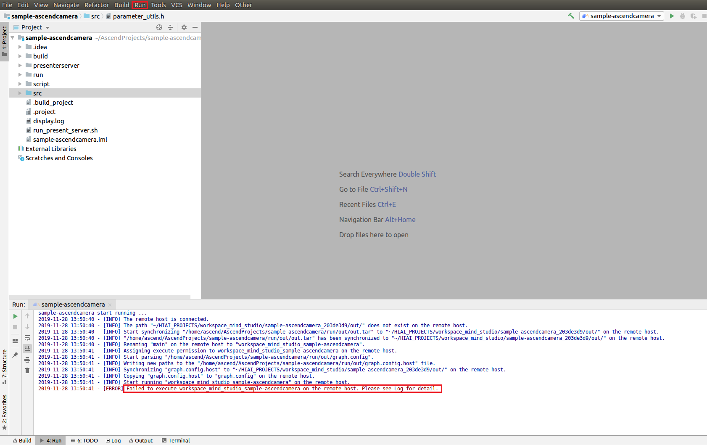

English|[中文](Readme.md)

**This case is only used for learning. It is not responsible for the effect and does not support commercial use.**
# Ascend Camera<a name="EN-US_TOPIC_0232643477"></a>

The Ascend camera application collects data through the camera on the Atlas 200 DK developer board, convert the data into JPG by using the digital vision pre-processing \(DVPP\) module, and save the video streams as files or remote output.

The applications in the current version branch adapt to  [DDK&RunTime](https://ascend.huawei.com/resources) **1.32.0.0 and later**.

## Prerequisites<a name="en-us_topic_0228461908_section137245294533"></a>

Before deploying this sample, ensure that:

-   Mind Studio  has been installed.
-   The Atlas 200 DK developer board has been connected to  Mind Studio, the cross compiler has been installed, the SD card has been prepared, and basic information has been configured.

## Deployment<a name="en-us_topic_0228461908_section412811285117"></a>

You can use either of the following methods:

1.  Quick deployment: visit  [https://gitee.com/Atlas200DK/faster-deploy](https://gitee.com/Atlas200DK/faster-deploy).

    > **NOTE:**   
    >-   The quick deployment script can be used to deploy multiple samples rapidly. Select  **ascendcamera**.  
    >-   The quick deployment script automatically completes code download, model conversion, and environment variable configuration. To learn about the detailed deployment process, go to  [2. Common deployment](#en-us_topic_0228461908_li3208251440).  

2.  <a name="en-us_topic_0228461908_li3208251440"></a>Common deployment: visit  [https://gitee.com/Atlas200DK/sample-README/tree/master/sample-ascendcamera](https://gitee.com/Atlas200DK/sample-README/tree/master/sample-ascendcamera).

    > **NOTE:**   
    >-   In this deployment mode, you need to manually download code, convert models, and configure environment variables.  


## Building a Project<a name="en-us_topic_0228461908_section11947911019"></a>

1.  Open the project.

    Go to  **MindStudio-ubuntu/bin**  under the installation package decompression directory \(for example,  **$HOME/MindStudio-ubuntu/bin**\) as the Mind Studio installation user and run the following command to start Mind Studio:

    **./MindStudio.sh**

    After the startup is successful, open the  **sample-ascendcamera**  project, as shown in the following figure.

    **Figure  1**  Opening the sample-camera project<a name="en-us_topic_0228461908_en-us_topic_0203223312_fig1696912234714"></a>  
    

    

2.  Configure project information in the  **src/param\_configure.conf**  file.

    **Figure  2**  Configuration file path<a name="en-us_topic_0228461908_en-us_topic_0203223312_fig10430135171116"></a>  
    

    

    The default configurations of the configuration file are as follows:

    ```
    remote_host=192.168.1.2
    ```

    -   **remote\_host**: IP address of the Atlas 200 DK developer board

    > **NOTE:**   
    >-   Do not use double quotation marks \(""\) during parameter settings.  
    >-   Modify the default configurations as required.  

3.  Run the  **deploy.sh**  script to adjust configuration parameters and download and compile the third-party library. Open the  **Terminal**  window of Mind Studio. By default, the home directory of the code is used. Run the  **deploy.sh**  script in the background to deploy the environment, as shown in  [Figure 3](#en-us_topic_0228461908_en-us_topic_0203223312_fig9298102581519).

    **Figure  3**  Running the deploy.sh script<a name="en-us_topic_0228461908_en-us_topic_0203223312_fig9298102581519"></a>  
    

    > **NOTE:**   
    >-   During the first deployment, if no third-party library is used, the system automatically downloads and builds the third-party library, which may take a long time. The third-party library can be directly used for the subsequent build.  
    >-   During deployment, select the IP address of the host that communicates with the developer board. Generally, the IP address is that configured for the virtual NIC. If the IP address is in the same network segment as the IP address of the developer board, it is automatically selected for deployment. If they are not in the same network segment, you need to manually type the IP address of the host that communicates with the developer board to complete the deployment.  

4.  Start building. Open Mind Studio and choose  **Build \> Build \> Build-Configuration**  from the main menu. The  **build**  and  **run**  folders are generated in the directory, as shown in  [Figure 4](#en-us_topic_0228461908_en-us_topic_0203223312_fig5350165415161).

    **Figure  4**  Build and files generated<a name="en-us_topic_0228461908_en-us_topic_0203223312_fig5350165415161"></a>  
    

    

    > **NOTICE:**   
    >When you build a project for the first time,  **Build \> Build**  is unavailable. You need to choose  **Build \> Edit Build Configuration**  to set parameters before the build.  

5.  Start Presenter Server.

    Open the  **Terminal**  window of Mind Studio. Under the code path, run the following command to start the Presenter Server program of the Ascend camera application on the server, as shown in  [Figure 5](#en-us_topic_0228461908_en-us_topic_0203223312_fig815812478221):

    **bash run\_present\_server.sh**

    **Figure  5**  Starting Presenter Server<a name="en-us_topic_0228461908_en-us_topic_0203223312_fig815812478221"></a>  
    

    

    When the message  **Please choose one to show the presenter in browser\(default: 127.0.0.1\):**  is displayed, type the IP address \(usually IP address for accessing Mind Studio\) used for accessing the Presenter Server service in the browser.

    Select the IP address used by the browser to access the Presenter Server service in  **Current environment valid ip list**, as shown in  [Figure 6](#en-us_topic_0228461908_en-us_topic_0203223312_fig20890201582816).

    **Figure  6**  Project deployment<a name="en-us_topic_0228461908_en-us_topic_0203223312_fig20890201582816"></a>  
    

    

    [Figure 7](#en-us_topic_0228461908_en-us_topic_0203223312_fig143112216312)  shows that the Presenter Server service has been started successfully.

    **Figure  7**  Starting the Presenter Server process<a name="en-us_topic_0228461908_en-us_topic_0203223312_fig143112216312"></a>  
    

    

    Use the URL shown in the preceding figure to log in to Presenter Server \(only Google Chrome is supported\). The IP address is that typed in  [Figure 6](#en-us_topic_0228461908_en-us_topic_0203223312_fig20890201582816)  and the default port number is  **7003**. The following figure indicates that Presenter Server has been started successfully.

    **Figure  8**  Home page<a name="en-us_topic_0228461908_en-us_topic_0203223312_fig3338812171913"></a>  
    

    The following figure shows the IP address used by Presenter Server and  Mind Studio  to communicate with the Atlas 200 DK.

    **Figure  9**  IP address example<a name="en-us_topic_0228461908_en-us_topic_0203223312_fig633991291914"></a>  
    

    -   The IP address of the Atlas 200 DK developer board is 192.168.1.2 \(connected in USB mode\).
    -   The IP address used by Presenter Server to communicate with the Atlas 200 DK is in the same network segment as the IP address of the Atlas 200 DK on the UI Host server, for example, 192.168.1.223.
    -   The following describes how to access the IP address \(such as  **10.10.0.1**\) of Presenter Server using a browser. Because Presenter Server and  Mind Studio  are deployed on the same server, you can access  Mind Studio  through the browser using the same IP address. 


## Running a Project<a name="en-us_topic_0228461908_section123001119164920"></a>

Run the Ascend camera application.

On the toolbar of Mind Studio, click  **Run**  and choose  **Run \> Run 'sample-ascendcamera'**. As shown in  [Figure 10](#en-us_topic_0228461908_en-us_topic_0203223312_fig19482184244914), the application is running on the developer board.

**Figure  10**  Application running<a name="en-us_topic_0228461908_en-us_topic_0203223312_fig19482184244914"></a>  




> **NOTE:**   
>You can ignore the error information reported during the execution because the IDE cannot transfer parameters for an executable application. In the preceding steps, the executable application and dependent library files are deployed to the developer board. You need to log in to the developer board in SSH mode and manually execute the files in the corresponding directory. For details, see the following steps.  

## Saving Media Information Offline<a name="en-us_topic_0228461908_section16681395119"></a>

1.  Log in to the developer board as the  **HwHiAiUser**  user in SSH mode on Ubuntu Server where  Mind Studio  is located.

    **ssh HwHiAiUser@192.168.1.2**

    For the Atlas 200 DK, the default value of  **host\_ip**  is  **192.168.1.2**  \(USB connection mode\) or  **192.168.0.2**  \(NIC connection mode\).

    For the AI acceleration cloud server,  **host\_ip**  indicates the IP address of the server where  Mind Studio  is located.

2.  Go to the path of the executable file of the Ascend camera application and run the following command:

    **cd \~/HIAI\_PROJECTS/workspace\_mind\_studio/sample-ascendcamera\_5b4f8b24/out**

3.  Run  **workspace\_mind\_studio\_sample-ascendcamera**  to save the media information offline.

    Obtain an image from the camera and save it as a .jpg file. If a file with the same name already exists, overwrite it.

    **./workspace\_mind\_studio\_sample-ascendcamera -i -c 1 -o  /localDirectory/filename.jpg --overwrite**

    -   **-i**: indicates that a JPG image is obtained.
    -   **-c**: indicates the channel to which a camera belongs to. This parameter can be set to  **0**  or  **1**. The value  **0**  corresponds to  **Camera1**, and the value  **1**  corresponds to  **Camera2**. If this parameter is not set, the default value  **0**  is used.

        For details, see "Viewing the Channel to Which a Camera Belongs" in  [Atlas 200 DK User Guide](https://ascend.huawei.com/documentation).

    -   **-o**: indicates the file storage location.  **localDirectory**  is the name of a local folder.  **filename.jpg**  is the name of a saved image, which can be user-defined.

        > **NOTE:**   
        >The  **HwHiAiUser**  user must have the read and write permissions on the path.  

    -   **--overwrite**: Overwrites the existing file with the same name.

    For other parameters, run the  **./** **workspace\_mind\_studio\_sample-ascendcamera**  command or the  **./** **workspace\_mind\_studio\_sample\_ascendcamera --help**  command. For details, see the help information.


## Playing a Real-Time Video Through Presenter Server<a name="en-us_topic_0228461908_section20204154716116"></a>

1.  Log in to the developer board as the  **HwHiAiUser**  user in SSH mode on Ubuntu Server where  Mind Studio  is located.

    **ssh HwHiAiUser@192.168.1.2**

2.  Go to the path of the executable file of the Ascend camera application and run the following command:

    **cd \~/HIAI\_PROJECTS/workspace\_mind\_studio/sample-ascendcamera\_5b4f8b24/out**

3.  Run the following command to transmit the video captured by the camera to Presenter Server:

    **./workspace\_mind\_studio\_sample-ascendcamera -v -c 1  -t 60 --fps 20 -w 704 -h 576 -s  _192.168.1.223:7002/presenter\_view\_app\_name_**

    -   **-v**: indicates that the video of the camera is obtained and displayed on the Presenter Server.
    -   **-c**: indicates the channel to which a camera belongs to. This parameter can be set to  **0**  or  **1**. The value  **0**  corresponds to  **Camera1**, and the value  **1**  corresponds to  **Camera2**. If this parameter is not set, the default value  **0**  is used. 

        For details, see "Viewing the Channel to Which a Camera Belongs" in  [Atlas 200 DK User Guide](https://ascend.huawei.com/documentation).

    -   **-t**: indicates that a video file lasting 60 seconds is obtained. If this parameter is not specified, the video file is obtained until the application exits.
    -   **--fps**: indicates the frame rate of a saved video. The value range is 1–20. The default video frame rate is 10 fps.
    -   **-w**: indicates the width of a saved video.
    -   **-h**: indicates the height of a saved video.
    -   The value  _192.168.1.223_  after  **-s**  refers to the IP address of port 7002 of Presenter Server, as shown in the information displayed after Presenter Server is started. It is also the IP address for communicating with the Atlas 200 DK developer board.  **7002**  is the default port number of Presenter Server for the Ascend camera application.
    -   _presenter\_view\_app\_name_: indicates the value of  **View Name**  on the  **Presenter Server**  page, which must be unique. The value consists of 3 to 20 characters and supports only uppercase letters, lowercase letters, digits, and underscores \(\_\).

    For other parameters, run the  **./workspace\_mind\_studio\_sample-ascendcamera**  command or the  **./workspace\_mind\_studio\_sample-ascendcamera  --help**  command. For details, see the help information.

    > **NOTE:**   
    >-   The Presenter Server of the Ascend camera application supports a maximum of 10 channels at the same time \(each  _presenter\_view\_app\_name_  parameter corresponds to a channel\).  
    >-   Due to hardware limitations, each channel supports a maximum frame rate of 20 fps. A lower frame rate is automatically used when the network bandwidth is low.  


## Follow-up Operations<a name="en-us_topic_0228461908_section856641210261"></a>

The Presenter Server service is always in running state after being started. To stop the Presenter Server service of the Ascend camera application, perform the following operations:

On the server with  Mind Studio  installed, run the following command as the  Mind Studio  installation user to check the process of the Presenter Server service corresponding to the Ascend camera application:

**ps -ef | grep presenter | grep display**

```
ascend@ascend-HP-ProDesk-600-G4-PCI-MT:~/sample-ascendcamera$ ps -ef | grep presenter | grep display
ascend 5758 20313 0 14:28 pts/24?? 00:00:00 python3 presenterserver/presenter_server.py --app display
```

In the preceding information,  _5758_  indicates the process ID of the Presenter Server service corresponding to the Ascend camera application.

To stop the service, run the following command:

**kill -9** _5758_

