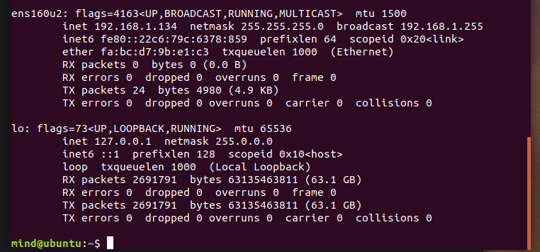
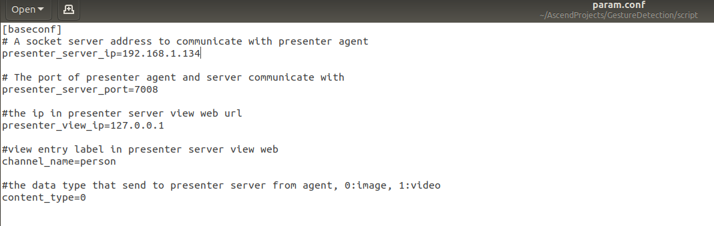
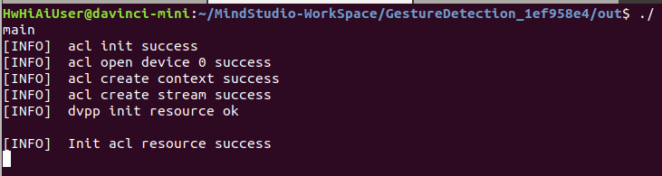
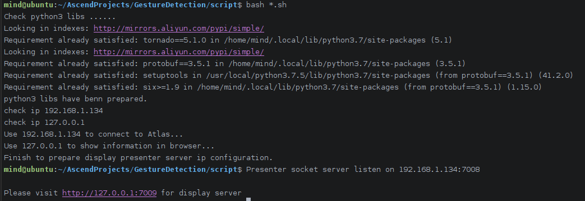
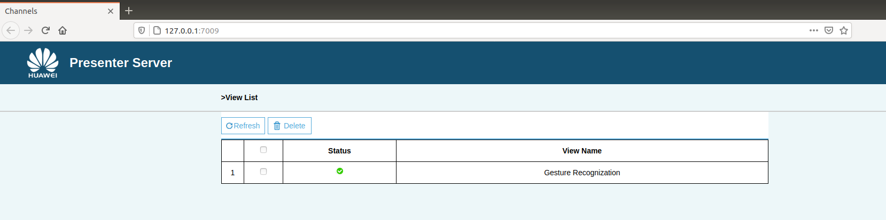
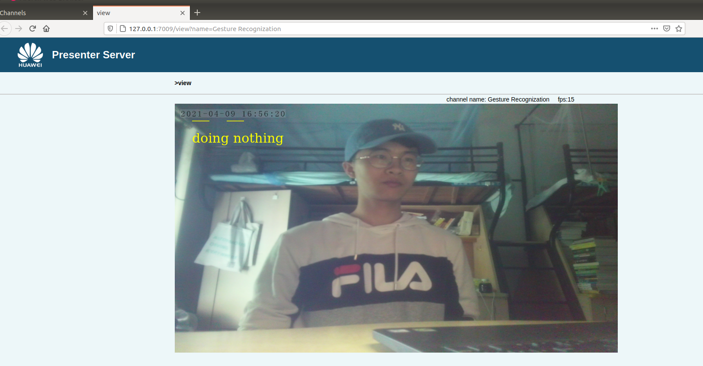

# 实时动作识别

## 环境配置

- 开发板：Atlas 200DK，树莓派摄像头（连接到开发板上）
- 环境：
  - 开发环境：CANN3.3.0alpha001
  - 运行环境：CANN3.2.0alpha001，从 [这里](https://gitee.com/ascend/samples/wikis/Atlas200dk%E8%BF%90%E8%A1%8C%E7%8E%AF%E5%A2%83%E6%90%AD%E5%BB%BA--%E7%94%A8%E9%95%9C%E5%83%8F%E6%81%A2%E5%A4%8D%E7%9A%84%E6%96%B9%E5%BC%8F?sort_id=3706490) 镜像恢复3.3.0.alpha001得到

## 模型准备

下载模型后放到 `GestureDetection/model` 文件夹下。

模型下载链接：https://pan.baidu.com/s/14HKFeIeWjBnSzOly5gh_qA 
		提取码：6qtt 

## 运行

- 配置好开发板IP地址，连接开发板。

  

- 配置 `GestureDetencion/script/param.conf` 中的 `presenter_server_ip` 为开发板IP

  

- 在MindStudio编译项目，运行。或将项目上传到开发板后，在开发板上运行 `main` 文件 ：

  

- 在 `GestureDetencion/script` 中用 `bash run_presenter_server` 打开 presenter server，查看运行效果

